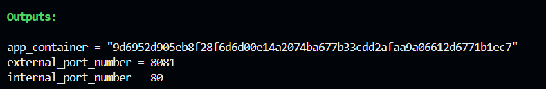
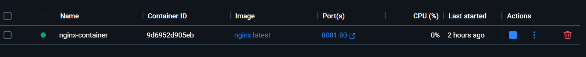

<p align="center">
      
  
</p>

<h1 align="center"> Terraform + Docker: Local Container Provisioning</h1>

<p align="center"><i>Automate Docker container setup using Terraform's Infrastructure as Code (IaC) workflow.</i></p>

---

## 🧠 What This Project Does

This project shows how to use **Terraform** to provision and manage a **local Docker container**. It’s a hands-on example of applying IaC principles in a local development environment.

---

## 🎯 Objectives

- Provision Docker containers using Terraform  
- Explore the Terraform Docker provider  
- Practice Terraform workflow commands (`init`, `plan`, `apply`, `destroy`)  
- Build a modular and maintainable setup

---

## Prerequisites 
```
| Tool       | Role                          |
|------------|-------------------------------|
| Terraform  | Infrastructure provisioning   |
| Docker     | Container runtime             |
```
---

## 📁 Project Structure

```bash
terraform-docker-setup/
├── main.tf              # Terraform config for Docker
├── variables.tf         # Input variables
├── outputs.tf           # Output values
├── terraform.tfstate    # State file (autogenerated)
├── README.md            # Project documentation
├── assets/              # Screenshots and visuals

```

----------

## ⚙️ Setup Instructions

### 1. Clone the Repository

```bash
git clone https://github.com/your-username/terraform-docker-setup.git
cd terraform-docker-setup

```

### 2. Initialize Terraform

```bash
terraform init

```

### 3. Preview the Plan

```bash
terraform plan

```

### 4. Apply the Configuration

```bash
terraform apply

```

### 5. Verify the Container

```bash
docker ps

```

Visit: [http://localhost:8080](http://localhost:8080/)

----------

## 🧹 Tear Down

To remove all Docker resources:

```bash
terraform destroy

```

----------

## 🛠️ Terraform Commands Reference


```
terraform init
```

- Initialize working directory

```
terraform plan
```

- Preview infrastructure changes

```
terraform apply
```

- Apply configuration and create infra

```
terraform destroy
```

- Remove all managed resources

```
terraform state
```

- Inspect Terraform-managed resources

----------

## 📸 Project Screenshots


### ✅ Terraform Apply Output



### ✅ Docker Container Running



### ✅ Web App Preview (if applicable)


----------

## 🤝 Contributing

Pull requests are welcome! For major changes, open an issue first to discuss your ideas.

----------

## 📄 License

This project is licensed under the MIT License.
